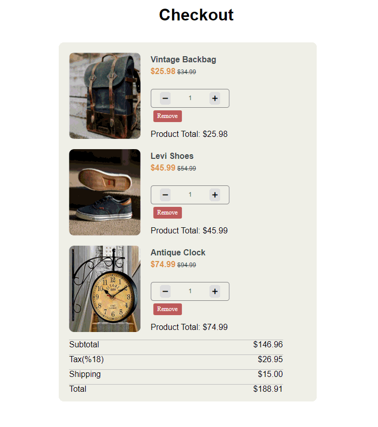

Elif's Space

## Project Name: Checkout

## Description
Project aims to create a real checkout page of e-commerce website.

## Learning Outcomes

At the end of the this project,

- analyze a problem, create e-commerce website page.

- demonstrate their knowledge of algorithmic design principles for dynamic calculation of product's cart.

   
## Problem Statement

- Create a checkout page following the design and make the calculation of cart dynamically with using of DOM and Event in JS.

-  User story;

   - When I click plus button on product's row, I can increase the product's quantity.
   - When I click minus button on product's row, I can decrease the product's quantity, but minimum quantity value can be 1.
   - When I click remove button on product's row or I decrease the quantity to 0, I can delete a product in the cart.
   - When I change any combination of product chart(plus, minus, remove etc.), I want to see the new calculation of chart's prices in concerned fields.
## Expected Outcome

  Happy Ending  ✍ 

